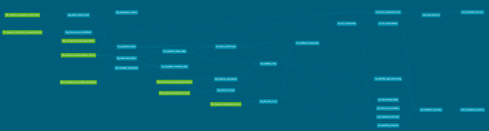

# Life Insurance BEL & Sensitivity Pipeline

**Version:** 1.1
**Author:** SukHee Lee
**Date:** April 2026
**Stack:** dbt + Databricks (Delta Lake)

---

## Executive Summary

This project implements a deterministic cashflow projection pipeline for **Best Estimate Liability (BEL)** valuation of a non-participating term life insurance portfolio under the **Solvency II** framework.

It transforms frozen actuarial assumptions — mortality tables, lapse curves, discount rates, and expense parameters — into the core analytical outputs used for regulatory valuation and risk assessment:

- **BEL by Cohort & Scenario** — present value of future net cashflows per model point
- **Sensitivity Analysis** — BEL response to mortality, lapse, and discount rate stresses
- **Validation Framework** — automated proof that actuarial identities hold across all projections
- **Portfolio Overview** — aggregated risk and sensitivity at management level

### Who Uses These Outputs?

| Team | What They Need | Which MART Model |
|------|---------------|-----------------|
| Actuarial / Valuation | BEL components, PV decomposition | mart_bel_components_core |
| Risk Management | Sensitivity to mortality, lapse, discount stresses | mart_bel_sensitivity |
| Capital / SCR | Directional SCR intuition by risk driver | mart_bel_sensitivity, mart_portfolio_overview |
| Governance / Audit | Calculation integrity proof | mart_validation_summary |
| Management | Portfolio-level BEL and risk summary | mart_portfolio_overview |

---

## Business Context

### The Problem

Under Solvency II, insurers must calculate the **Best Estimate Liability** — the probability-weighted present value of all future cashflows arising from insurance obligations. For life insurance, this involves projecting premiums, death benefits, and expenses month by month, applying decrement assumptions (mortality, lapse), and discounting at the regulatory risk-free rate.

The BEL is sensitive to its input assumptions. Regulators require insurers to quantify this sensitivity through stress testing, which feeds into the Solvency Capital Requirement (SCR).

### What This Pipeline Does

1. **Defines** a portfolio of 8 model points (4 cohorts × 2 sexes) representing a non-participating term life book
2. **Projects** monthly cashflows from valuation date to contract maturity
3. **Applies** mortality and lapse decrements to roll forward the in-force population
4. **Discounts** cashflows using the EIOPA risk-free rate curve with linear interpolation
5. **Aggregates** present values into BEL per cohort, sex, and scenario
6. **Stress tests** under 9 scenarios (mortality ±10%, lapse ±10%, discount ±50bps, combined, persistency)
7. **Validates** every calculation step against actuarial identities

---

## Portfolio Design

| Cohort | Issue Age | Term | Elapsed | Attained Age | Remaining | Key Purpose |
|--------|-----------|------|---------|-------------|-----------|-------------|
| C1 | 35 | 30Y | 5Y | 40 | 25Y | Young, long-duration — premium-dominated, discount-sensitive |
| C2 | 50 | 25Y | 10Y | 60 | 15Y | Mid-age, long-elapsed — high duration_year lapse effect |
| C3 | 60 | 20Y | 5Y | 65 | 15Y | Senior — high mortality, same remaining as C2 for comparison |
| C4 | 65 | 15Y | 3Y | 68 | 12Y | Elderly, short-remaining — mortality-dominated |

Each cohort has male and female model points with differentiated policy counts reflecting demographic patterns.

---

## Pipeline Architecture

```
RAW (Databricks Notebook) → STG (dbt view) → INT (dbt view) → VALIDATION (dbt view) → MART (dbt table)
```

| Layer | Models | Responsibility |
|-------|--------|---------------|
| RAW | 8 tables | Frozen actuarial assumptions & product definition |
| STG | 8 views | Input standardization, version filtering, derived fields |
| INT | 7 views | Projection engine: rates, in-force rollforward, cashflows, discounting, BEL |
| VALIDATION | 7 views | Automated proof of actuarial identities |
| MART | 4 tables | Decision-ready outputs for business consumption |
| **Total** | **26 dbt models** | |

### Model Lineage (DAG)

```
stg_policy_cohort_input ──┐
stg_stress_scenario_def ──┼──► int_projection_frame
                          │         │
stg_mortality_assumption ─┼──► int_projection_mortality_rates ──┐
stg_lapse_assumption ─────┼──► int_projection_lapse_rates ──────┼──► int_inforce_rollforward ──┐
                          │                                     │                              │
stg_premium_input ────────┤                                     │    stg_expense_assumption ───┤
                          │                                     │                              │
                          │                     int_cashflow_lines ◄────────────────────────────┘
                          │                              │
stg_discount_curve ───────┼──────────► int_cashflows_discounted
                          │                              │
                          │                     int_bel_components
                          │                        │         │
                          │    mart_bel_components_core      │
                          │         │                        │
                          │    mart_bel_sensitivity          │
                          │                                  │
                          │              mart_portfolio_overview
                          │
val_projection_continuity ─┐
val_inforce_reconciliation ┤
val_cashflow_sign_timing ──┼──► val_validation_summary ──► mart_validation_summary
val_discounting_sanity ────┤
val_bel_reconciliation ────┤
val_sensitivity_direction ─┘
```

### Model Lineage (DAG)



---

## Key Technical Decisions

### 1. Cumulative Product for In-Force Rollforward

The in-force rollforward is inherently recursive: each month's opening equals the previous month's closing. Instead of a recursive CTE, the pipeline uses the **log-sum-exp cumulative product** pattern:

```sql
IF_open(t) = policy_count × EXP(SUM(LN((1 - q(k)) × (1 - l(k)))) OVER (... ROWS PRECEDING))
```

This produces mathematically identical results without recursion, executing efficiently on Databricks SQL.

### 2. SEQUENCE + EXPLODE for Projection Axis

Monthly projection rows (1 to remaining_months) are generated dynamically using Databricks SQL's native `SEQUENCE()` + `EXPLODE()`, avoiding hardcoded row generators or recursive CTEs.

### 3. Valuation Date as dbt Variable

The valuation date is portfolio-wide, not per-cohort. Managing it as `{{ var('valuation_date') }}` in dbt enables re-valuation at any date by changing a single parameter.

### 4. Linear Interpolation on Discount Curve

The EIOPA RFR curve provides annual tenor points (12, 24, ..., 1800 months). Monthly projection months between annual tenors use linear interpolation on zero rates, with stress shift (bps) applied after interpolation.

### 5. Negative Rate Under Stress

Under RATE_DOWN (-50bps), short-tenor base rates near zero can produce negative interpolated rates, causing DF > 1.0 at projection_month=1. This is mathematically valid and consistent with the EIOPA framework's allowance of negative rates. The effect is negligible (diff < 0.001).

---

## Stress Testing & Results

### Scenario Design

| Scenario | Mortality | Lapse | Discount | Group |
|----------|-----------|-------|----------|-------|
| BASE | 1.00× | 1.00× | 0 bps | — |
| MORT_UP | 1.10× | 1.00× | 0 bps | Core |
| MORT_DOWN | 0.90× | 1.00× | 0 bps | Core |
| LAPSE_UP | 1.00× | 1.10× | 0 bps | Core |
| LAPSE_DOWN | 1.00× | 0.90× | 0 bps | Core |
| RATE_UP | 1.00× | 1.00× | +50 bps | Core |
| RATE_DOWN | 1.00× | 1.00× | -50 bps | Core |
| COMBINED_ADVERSE | 1.10× | 1.00× | -50 bps | Advanced |
| PERSIST_IMPROVE | 1.00× | 0.70× | 0 bps | Advanced |

### Portfolio-Level Results

| Scenario | Total BEL | Delta BEL | Interpretation |
|----------|-----------|-----------|---------------|
| BASE | 18.1M | — | Net liability position |
| MORT_UP | +12.4M | +68.5% | Mortality is the dominant risk driver |
| COMBINED_ADVERSE | +14.7M | +80.9% | Compounding: mortality up + rate down |
| RATE_DOWN | +1.8M | +9.7% | Duration effect on long cashflows |
| RATE_UP | -1.6M | -9.0% | Symmetric discount impact |
| LAPSE_UP | -1.1M | -6.3% | Liability release exceeds premium loss |

---

## 📈 Multi-Curve EIOPA RFR Analysis

The pipeline supports multiple EIOPA RFR discount curves simultaneously, enabling BEL comparison across curve versions.

### Curves Loaded

| Version ID | Date | VA | Source |
|---|---|---|---|
| RFR_20251231_noVA | 2025-12-31 | No | EIOPA Monthly RFR |
| RFR_20251231_withVA | 2025-12-31 | Yes | EIOPA Monthly RFR |
| RFR_20260331_noVA | 2026-03-31 | No | EIOPA Monthly RFR |
| RFR_20260331_withVA | 2026-03-31 | Yes | EIOPA Monthly RFR |

### BEL Impact (BASE Scenario)

| Curve | Total BEL | Δ vs 2025-Q4 noVA |
|---|---|---|
| 2025-Q4 no VA | €18.14M | — |
| 2025-Q4 with VA | €17.67M | −2.6% |
| 2026-Q1 no VA | €18.04M | −0.6% |
| 2026-Q1 with VA | €17.44M | −3.9% |

**Maximum difference: €0.70M (3.9%)** — driven entirely by discount curve selection.

### Implementation

Adding four curves required modifying 9 dbt models with zero changes to actuarial logic:
- `stg_discount_curve` — removed single-version filter, exposing all curve versions
- `int_cashflows_discounted` — cross join with curve versions for parallel discounting
- Downstream models — `version_id` propagation through GROUP BY and JOIN conditions

This worked because discount curves were modeled as data (versioned assumptions), not as logic.

See [Medium Article #10: Discounting Is Not a Number](https://medium.com/@lsh5864) for the full analysis.

---

## 📊 Multi-Mortality Version Analysis

The pipeline supports multiple mortality assumption versions simultaneously, enabling BEL comparison across different mortality bases.

### Mortality Versions Loaded

| Version ID | Source | Method |
|---|---|---|
| MORT_2026_04 (INSEE 2019) | INSEE national mortality table, 2019 | Industry benchmark, single-year snapshot |
| MORT_EXP_STUDY | HMD France 2015–2023 | Experience study: A/E graduation, credibility weighting |

The experience study mortality was built using the standard actuarial process: A/E ratio calculation, polynomial graduation, and Limited Fluctuation Credibility weighting against the INSEE 2019 industry table. The nine-year observation window (2015–2023) includes COVID-19 pandemic years, producing structurally higher mortality at older ages.

### BEL Impact (BASE Scenario, 2025-Q4 no VA Curve)

| Mortality Version | Total BEL | Δ vs INSEE 2019 |
|---|---|---|
| INSEE 2019 | €18.14M | — |
| Experience Study | €26.83M | +€8.7M (+48%) |

**Mortality effect: +48%.** Discount curve effect across all four curves: 3.9%. In this portfolio, mortality dominates discounting as a BEL driver by an order of magnitude.

### Cross-Effect: Mortality × Discounting

The VA discount impact increases under higher mortality (−€0.47M with INSEE vs −€0.56M with Experience Study), confirming that mortality and discounting are not independent — they interact through the cashflow structure.

### Implementation

Adding a second mortality version required modifying 12 dbt models with zero changes to actuarial logic — the same dimensional extension pattern proven with multi-curve discounting (Article #10). The `mort_version_id` column was propagated through GROUP BY and JOIN conditions alongside the existing `version_id`.

See [Medium Article #11: Assumptions Are Built, Not Given](https://medium.com/@lsh5864) for the full experience study methodology and BEL impact analysis.

---

## Validation Framework

Every calculation is validated against actuarial identities:

| Check | What It Validates |
|-------|------------------|
| Projection Continuity | Month sequence is continuous from 1 to remaining_months |
| In-Force Reconciliation | `open - deaths - lapses = close` at every month |
| Cashflow Sign & Timing | Premium ≤ 0 (month_start), benefit/expense ≥ 0 (month_end) |
| Discounting Sanity | DF > 0 and non-null for all cashflows |
| BEL Reconciliation | `benefit_pv + expense_pv + premium_pv = bel_amount` |
| Sensitivity Direction | Mortality up → BEL up, Discount up → BEL down |

**Result: 72/72 model points × scenarios = ALL PASS**

---

## Assumptions & Data Sources

| Assumption | Source | Grain |
|-----------|--------|-------|
| Mortality | EIOPA illustrative / INSEE / HMD tables | Age (0–100) × Sex |
| Lapse | Deterministic duration-based curve | Duration year (1–30) |
| Discount | EIOPA RFR-style zero curve | Tenor month (12–1800) |
| Expense | Premium-proportional maintenance (3%) | Single rate |
| Premium | Python pricing formula (locked-in at issue) | Cohort × Sex |

All assumptions are generated via Databricks Notebooks (Python) and stored as Delta tables with version tracking.

---

## Technology Stack

- **Databricks** — Notebooks (RAW generation), SQL Warehouse (dbt execution), Delta Lake (storage)
- **dbt** (dbt-databricks adapter) — Transformation logic, testing, documentation
- **Delta Lake** — ACID transactions, schema enforcement, time travel
- **Python** — Premium pricing, assumption generation

---

## Simplifications vs. Production

| This Project | Production Reality |
|---|---|
| 8 model points | Millions of individual policies or granular model points |
| Deterministic projection | Stochastic simulation for guarantees and options |
| Multiple curves (with/without VA) | Multi-curve implemented (4 EIOPA RFR versions) |
| No risk margin | Risk margin via Cost-of-Capital method |
| No SCR calculation | Standard Formula or Internal Model SCR |
| No dynamic lapse | Policyholder behavior models linked to economic conditions |
| Simple average expense | Detailed expense analysis by type and allocation |
| Mortality improvement models | Multi-version implemented (INSEE + Experience Study); production would add mortality improvement models (CMI, Lee-Carter) |
| No reinsurance | Gross and net BEL with reinsurance recovery |

---

## Project Series

This is Part 3 of a 5-project series building toward a comprehensive insurance data platform:

1. **Small:** Insurance Policy Admin Mart — Portfolio Structure & KPIs
2. **Medium-1:** Motor Insurance Claims Development & Loss Forecasting (P&C, backward-looking)
3. **Medium-2:** This project — Life Insurance BEL Pipeline (Life, forward-looking)
4. **Medium-3:** Reinsurance IFRS 17 — Retro Linkage & Loss Recovery
5. **Large:** Insurance Fraud Detection Pipeline on Azure (planned)

---

## Author

**SukHee Lee** — Actuarial Data Analyst | IFRS 17 · dbt · Databricks
Building insurance data pipelines across reserving, valuation, and analytics engineering workflows.

GitHub: github.com/SHLee5864
Medium: medium.com/@lsh5864
